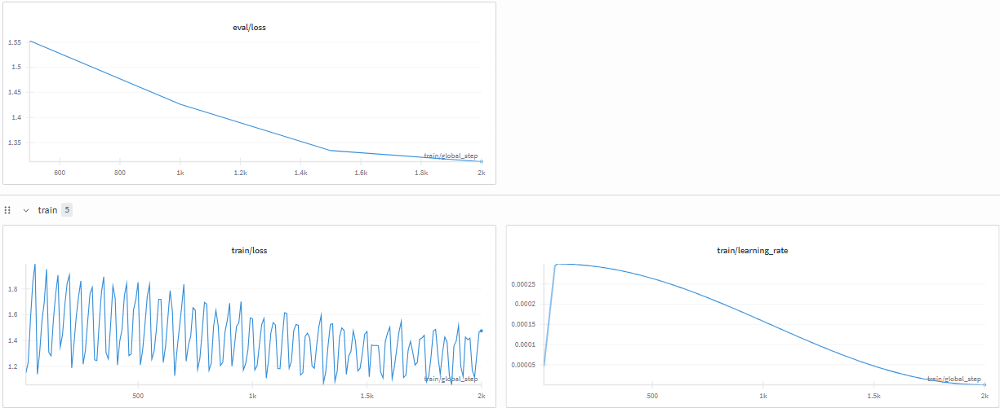

# LLM Human-User Fine-tuning 

## Overview

This project fine-tunes an AI model to act as a **human user** responding to AI assistant questions, rather than the traditional approach where the AI acts as an assistant answering human questions.

## Project Purpose

The experiment aims to:
- Train an AI model to generate human-like responses to AI questions
- Create a model that acts as the user side of conversations


## Technical Approach

### Base Model
The project uses [Qwen2.5-7B](https://huggingface.co/Qwen/Qwen2.5-7B), a 7.6 billion parameter language model from Alibaba Cloud. This model was chosen for its strong performance in conversational tasks and its ability to handle diverse language patterns.

### Dataset
The training data comes from the [OpenAssistant Conversations Dataset (OASST1)](https://huggingface.co/datasets/OpenAssistant/oasst1), which contains over 88,000 human-AI conversations. The dataset includes:
- Multi-turn conversations between humans and AI assistants
- Conversations in 35 different languages
- High-quality, human-reviewed interactions

### Role Processing

1. **Data Processing**: The original conversations are processed to extract message pairs while preserving original roles
2. **Role Preservation**: 
   - `prompter` = human user (what the model learns to be)
   - `assistant` = AI (provides context/questions)
3. **Training Target**: The model learns to generate human user responses to AI assistant questions

### Training Format

**Input (Chat History):**
```
Assistant: How can I help you today?
```

**Target Output (What the model learns to generate):**
```
User: I want the recipe for a chocolate cake
```

### Fine-tuning Method
The model is fine-tuned using **QLoRA (Quantized Low-Rank Adaptation)**, which allows efficient training of large language models on consumer hardware by:
- Using 4-bit quantization to reduce memory usage
- Applying low-rank adapters to update only a small subset of parameters
- Maintaining model performance while significantly reducing computational requirements

## Project Structure

- **Data Processing**: Scripts to clean and process conversation data while preserving original roles
- **Dataset Creation**: Tools to generate training, validation, and test splits with human-user targets
- **Model Training**: QLoRA fine-tuning implementation
- **Evaluation**: Methods to assess the model's performance in generating human-like responses

## Usage

### Data Processing
```bash
python process_data.py
```

### Dataset Creation
```bash
python create_finetune_data.py
```

### Training
```bash
python train.py
```

## Expected Behavior

After fine-tuning, the model will:

- **Input**: "Assistant: How can I help you today?"
- **Output**: "User: I want the recipe for a chocolate cake"

The model learns to act as a human user responding to AI assistant questions, providing realistic human-like responses to various prompts and questions.

## Results
Was only able to train for .2 epoch on my computer (~8 hours on a 3060 Ti 8gb). But the train/loss and eval/loss are showing that the model is learning (something).

In the future i will train for a full epoch and see how the model performs.


